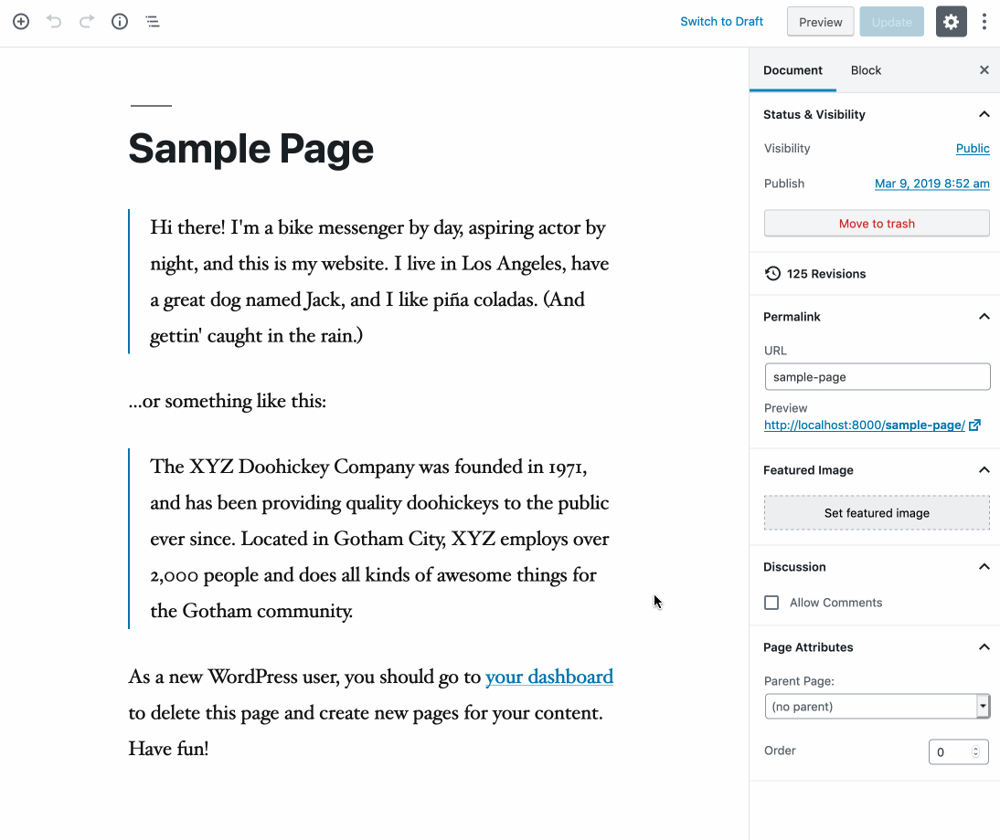

# A/B Testing for WordPress

WordPress plugin which allow you to run A/B tests from anywhere within your content.

Utilize the new Gutenberg editor to create split tests to serve to your visitors and find out
which variation works best.



## Installing

1. Download `ab-testing-for-wp.zip` found on the [latest release](https://github.com/Gaya/ab-testing-for-wp/releases/latest)
1. Unzip contents and upload "ab-testing-for-wp" folder to the "/wp-content/plugins/" directory.
1. Activate the plugin through the "Plugins" screen in WordPress.
1. You can now add tests to your content!

## Requirements

- At least WordPress 5.0 (uses the new Gutenberg editor)

## JavaScript Bundle Development

Requirements: [Node.js](https://nodejs.org/en/)

Clone the project and `npm install`.

Use the following commands:

```
# one time build
npm run build

# development watch mode for JavaScript
npm run dev

# prepare for release (clean, build, archive)
npm run release
```

## Using Docker for development

Requirements: [Composer](https://getcomposer.org/), [Docker](https://www.docker.com/products/developer-tools)

```
# Starting Docker container:
docker-compose up -d
```

Development WordPress install now runs at [localhost:8000](http://localhost:8000)

`./wp-content` of the project root is synced with the development install's `wp-content`.

Look at `docker-compose.yml` for database passwords.

## Testing and linting

This project is tested using [Cypress](https://www.cypress.io/) and linted using [eslint](https://eslint.org/). These dependencies get installed with the project automatically.

### ESLint

Linting makes sure the code style is in order. This will also be performed on the main repository when creating a pull request.

In order to run linting on your local environment run the following command from the root of the project:

```
npm run lint
```

### Cypress

Running all end-to-end tests makes sure all functionality is still in place after updates to the code have been made.

Run all tests by entering the following command:

```
npm run test
```

There are a few extra command to help you test and develop locally:

```
# run local test environment and open Cypress
npm run test:dev

# tear down the setup environment and create a new one
npmr run e2e:setup-env

# reset the database to be a fresh WordPress install
npm run e2e:reset-db
```


